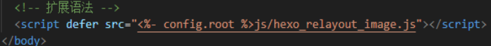
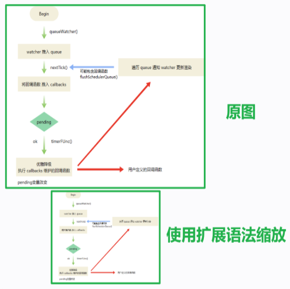

# 1 背景

近期在使用 Hexo 

用 Markdown 语法过程中

发现 Markdown 的原生语法**无法设置图片的大小**


如官方推荐的引入图片方法：

```

```

```

```

无法设置图片大小，并且图片会默认靠左边


如果想要实现图片 **水平居中 + 调节大小**

好像只能通过写 HTML + CSS

```html
<div align="center">
    
</div>
```

怪麻烦的


**于是我用  JS 扩展了 Markdown 语法，通过更简单的方式实现图片的放大缩小 + 水平居中****

可以在 GIthub 上下载源码：


# 2 使用语法

## 2.1 GIthub 上下载源码后

将 hexo_relayout_image.js 文件移动至 public/js/ 下


## 2.2 增加 script 脚本

进入你的主题下 layout 目录中的 layout.ejs 文件

> 我用的主题是Cupertino：路径就是 /themes/Cupertino/layout/layout.ejs

将下面的代码加入到 body 中

```js
<!-- 扩展语法 -->
<script defer src="<%- config.root %>js/hexo_relayout_image.js"></script>
```




## 2.3 使用语法

> Hexo 内部会将 `` 转为 `img` 标签格式
>
> 官网：`` will be rendered as ``.


我的扩充的语法格式如下：

```javascript

```

- 在路径后使用 **?** 分隔
- 然后输入宽(width)、高(height)，并使用 **&** 连接

然后：

该图片将 **按照设置的宽(width)、高(height)** 重绘

并且该图片会 **自动实现水平居中**


# 3 效果

